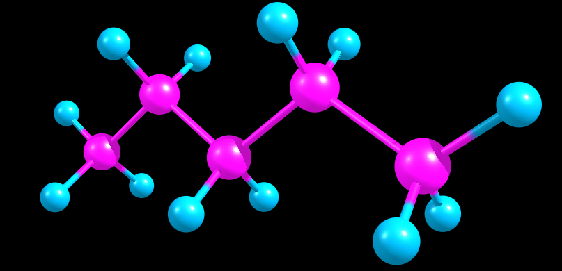

# Alkanes
Conformation generator library.

## Overview


Generates all physically valid conformations for a given n-alkane.

## Example
```cpp
#include <iostream>

#include "conformations.h"

using namespace Alkanes;

int main() {
  constexpr int N = 3; // carbon atoms 
  All_conformations Cn(N);
  auto fut = Cn.conformations(); // coroutine handle
  // A -- anti
  // G -- gauche
  // E -- eclipsed

  while (fut.next()) {
    try {
      auto next_conforamtion = Alkane(fut.get());
      std::cout << fut.get() << std::endl;
      std::cout << next_conforamtion << std::endl;
    } catch (BadConformation &bc) {
      std::cout << bc.what() << " in " << fut.get() << std::endl;
      continue;
    }
  }

  return 0;
}
```

## Requirements

* g++-10


## Usage

* cd alkanes
* mkdir build && cd build
* cmake ..
* make
